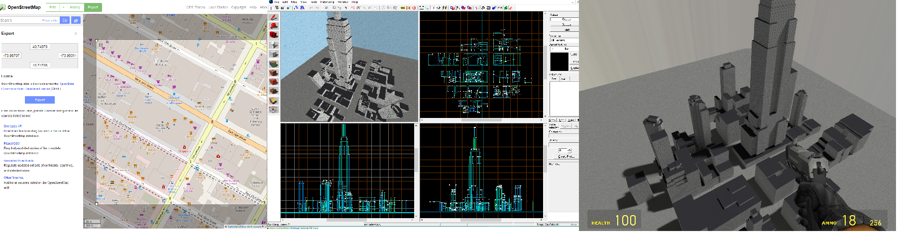

# [OpenStreetMap](www.openstreetmap.org) to [Valve Map Format](https://developer.valvesoftware.com/wiki/Valve_Map_Format) converter

This is a console program that imports [*.osm XML](https://wiki.openstreetmap.org/wiki/OSM_XML) text file, and exports [vmf](https://developer.valvesoftware.com/wiki/VMF_(Valve_Map_Format)), [obj](https://en.wikipedia.org/wiki/Wavefront_.obj_file) and [map](https://developer.valvesoftware.com/wiki/MAP_(file_format)) .
Currently, it uses information only about buildings.

Since only convex polygons can be used in vmf/map, the program uses the [polygon decomposition algorithm created by Mark Bayazit](https://mpen.ca/406/bayazit).

## How to use it

1) Export osm data from https://www.openstreetmap.org
2) Execute `osm2vmf.exe` with path to file as argument
   > Optional arguments:
   
   > -obj
   
   > -map
   
   > -novmf
4) Open created vmf file in VHE 4.x or Hammer++ 
   (map file in VHE 3.x, JACK or TrenchBroom)

4) Add some entities
5) Compile and run map
